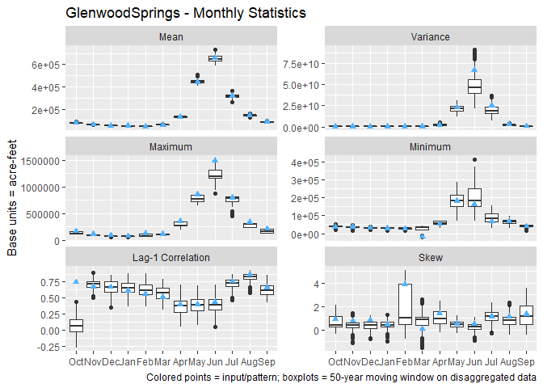
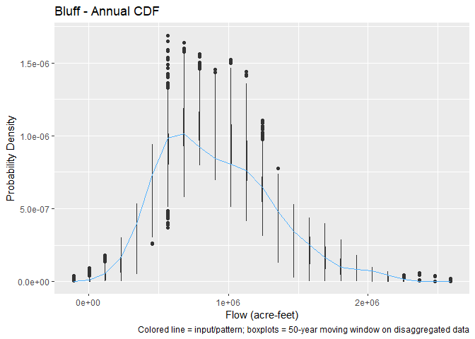
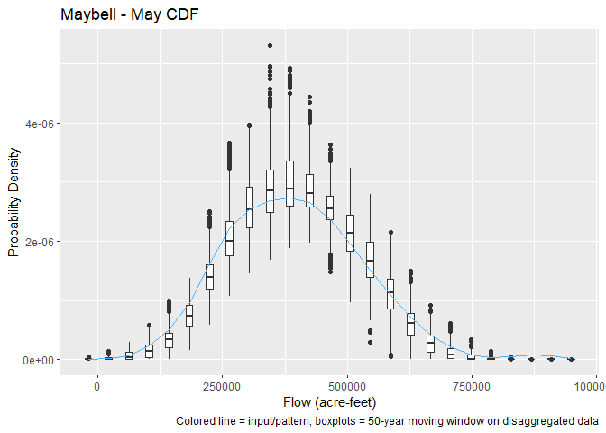

<!-- README.md is generated from README.Rmd. Please edit that file -->

# knnstdisagg

An R package to perform space and time disaggregation of streamflow
using a K-nearest neighbor (knn) approach.

**In development**

[](https://www.repostatus.org/#wip)
[](https://github.com/rabutler-usbr/knnstdisagg/actions)
[](https://codecov.io/gh/rabutler-usbr/knnstdisagg?branch=master)

## Installation

Currently only available on GitHub

``` r
# install.packages("remotes")
remotes::install_github("rabutler-usbr/knnstdisagg")
```

## Example Usage

One application of the KNN space-time disaggregation methodology is to
take paleo reconstructed data at Lees Ferry in the Colorado River Basin,
and disaggregate those annual flows at one location to monthly flows at
29 locations. The following steps through how to use the knnstdisagg
package to do so.

As the space-time disaggregation method relies on monthly pattern data,
we need monthly pattern data, and we will use the
[CoRiverNF](https://github.com/BoulderCodeHub/CoRiverNF) package for
those data.

``` r
remotes::install_github("BoulderCodeHub/CoRiverNF")
```

### Setup the data

The space-time disaggregation disaggregates an annual value (`ann_flow`)
to monthly data by matching `ann_flow` to an annual index value
(`ann_index_flow`). Then, the monthly pattern and spatial pattern
(`mon_flow`) from the selected annual index year is used to disaggregate
the data.

In this example, we will be disaggregating the Meko et al. (2007) paleo
reconstructed data (`meko`), which is provided as an example dataset in
this package:

``` r
library(knnstdisagg)
library(CoRiverNF)
#> Loading required package: xts
#> Loading required package: zoo
#> 
#> Attaching package: 'zoo'
#> The following objects are masked from 'package:base':
#> 
#>     as.Date, as.Date.numeric
#> CoRiverNF package currently includes 1906-2018 natural flows, released January 10, 2020.

head(meko)
#>      water_year lees_ferry
#> [1,]        762   16360000
#> [2,]        763   13190000
#> [3,]        764   12140000
#> [4,]        765   12690000
#> [5,]        766   16660000
#> [6,]        767   14380000
```

`meko` is already formatted correctly for use in this package: one
column of years and one column of annual data.

The annual index flow and monthly values are from the CoRiverNF package.
We will match the `meko` data to the historical water year data at Lees
Ferry. Additionally, for now, the index data needs to be a two column
matrix and not an xts object. For the monthly data, we need it to be
full water years, so need to remove the last three months of data so it
stops at the end of the last water year.

``` r
# setup annual data
annual_index <- CoRiverNF::wyAnnTot$LeesFerry
yrs <- as.numeric(format(index(wyAnnTot$LeesFerry), "%Y"))
annual_index <- as.matrix(annual_index)
annual_index <- cbind(yrs, annual_index)

# setup monthly data
last_month <- paste0("/", max(yrs), "-09")
monthly_data <- CoRiverNF::monthlyInt[last_month]
```

*Note, this example uses a named xts object for the monthly data, which
means the results are also a named xts object. An unnamed matrix will
also work.*

### Space-time disaggregation

The space-time disaggregation is performed by `knn_space_time_disagg()`.
We have already setup the data necesary for `ann_flow`,
`ann_index_flow`, and `mon_flow`. Because this is water year data, we
will set the `start_month` to 10 as the water year starts in October. We
will only disaggregate the data once, so there is only one “simulation”.
In previous work, we have found that we want to scale the Upper Basin
nodes based on the volume at Lees Ferry, but in the Lower Basin, we will
not scale their values, i.e., we will select the monthly data directly
for the selected index year. The Upper Basin sites are sites 1-20.
Finally, we will use the default weighting scheme from Nowak et al. to
select the nearest neighbor.

``` r
disagg <- knn_space_time_disagg(
  ann_flow = meko,
  ann_index_flow = annual_index,
  mon_flow = monthly_data,
  start_month = 10,
  nsim = 1,
  scale_sites = 1:20,
  k_weights = knn_params_default(nrow(annual_index))
)
#> Sites 21, 22, 23, 24, 25, 26, 27, 28, 29
#> will be selected directly from the index years, i.e., not scaled.
```

The results are now in `disagg`, and we can get the output using
`knnst_get_disagg_data()`:

``` r
head(knnst_get_disagg_data(disagg)[,5:10]) # only look at a few sites
#>          Crystal GrandJunction CiscoDolores CiscoColorado Fontenelle
#> 761-10  5496.806      42774.55     9924.075    -11794.530   35006.34
#> 761-11 11612.817      34891.78    10611.423      8794.297   34168.88
#> 761-12 12760.371      29607.30     7648.717     -6256.246   20943.36
#> 762-01 11310.621      21888.47     7702.046      6900.140   24289.25
#> 762-02  7189.498      20530.56     9353.260      4965.494   25263.98
#> 762-03  9582.376      28246.43    18130.768      5265.715   38276.18
#>        GreenRiverWY
#> 761-10     9248.578
#> 761-11     7672.419
#> 761-12     6273.035
#> 762-01     4744.279
#> 762-02     4605.031
#> 762-03     5102.766
```

If needed, the output can be saved to disk using `write_knnst()`. This
saves the disaggregated data for every simulation as well as the
selected index years.

### QA/QC

The knnstdisagg package also includes plotting functionality to assist
with QA/QC. Plots of monthly statistics (), annual statistics (same as
monthly), annual cdf, and a monthly cdf for each month can be created
using `plot()`. Each call to plot works for one site. Looking at
Glenwood Springs monthly statistics:

``` r
p <- plot(
  disagg, 
  site = "GlenwoodSprings", 
  base_units = "acre-feet", 
  which = 14, 
  show = TRUE
)
```



Note that because we only ran one simulation/version of the
disaggregation, the boxplot collapses to near the historical for the
mean. However, it shows that maxima (minima) larger (smaller) than the
observed are created.

We can also look at the annual cdf for Bluff, or the May cdf for
Maybell:

``` r
p <- plot(
  disagg, 
  site = "Bluff", 
  base_units = "acre-feet", 
  which = 13, 
  show = TRUE
)
```



``` r
p <- plot(
  disagg, 
  site = "Maybell", 
  base_units = "acre-feet", 
  which = 5, 
  show = TRUE
)
```



All plots for a given site can be created at once using `which = 1:15`,
and the suite of plots can be saved using `save_knnstplot()`. For
example, all plots for the data at Cameo could be saved to a pdf using:

``` r
p <- plot(
  disagg, 
  site = "Cameo", 
  base_units = "acre-feet", 
  which = 1:15, 
  show = FALSE
)
save_knnstplot(p, "Cameo.pdf", width = 8, height = 6)
```

*If an unnamed matrix was used for input, then the sites are accessed by
`"S1"`, `"S2"`, etc. during plotting.*

### Recreating Disaggregation

**Will be added to vignette**

## Acknowledgements

This package implements the methods developed by Nowak et al. (2010):

Nowak, K., J. Prairie, B. Rajagopalan, and U. Lall (2010), A
nonparametric stochastic approach for multisite disaggregation of annual
to daily streamflow, Water Resour. Res., 46, W08529,
[doi:10.1029/2009WR008530](https://agupubs.onlinelibrary.wiley.com/doi/abs/10.1029/2009WR008530).

It also uses the Meko et al. (2007) paleo reconstructed Lees Ferry
natural flow as example data in the package and above:

Meko, D.M., Woodhouse, C.A., Baisan, C.A., Knight, T., Lukas, J.J.,
Hughes, M.K., and Salzer, M.W. 2007. Medieval Drought in the Upper
Colorado River Basin. Geophysical Research Letters 34, L10705.

## Disclaimer

This software is in the public domain because it contains materials that
originally came from the U.S. Bureau of Reclamation, an agency of the
United States Department of Interior.

Although this code has been used by Reclamation, no warranty, expressed
or implied, is made by Reclamation or the U.S. Government as to the
accuracy and functioning of the program and related program material nor
shall the fact of distribution constitute any such warranty, and no
responsibility is assumed by Reclamation in connection therewith.

This software is provided “AS IS.”
